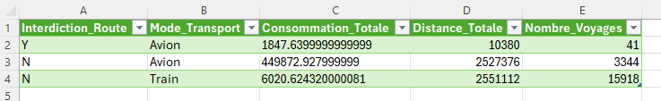
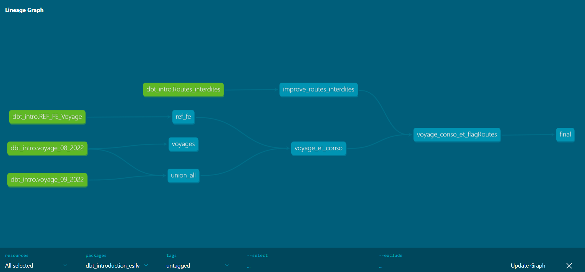

## SETUP:

### Requirements

- [Download and install Python 3.11.x](https://www.python.org/downloads/release/python-3116/)
- [Download and install Git](https://git-scm.com/downloads)
- [Download and install VScode](https://code.visualstudio.com/download)
- For windows: [Download and install windows terminal](https://learn.microsoft.com/en-us/windows/terminal/install)

### Get the code and install python environment

- Open a terminal
- Clone the repository: `git clone https://github.com/HaysKeener/dbt_introduction_esilv`
- Change directory in the repository folder: `cd dbt_introduction_esilv`
- If you have conda installed you will need to deactivate it: `conda deactivate`
- Setup a python environment: 
    - MacOs: `python3 -m venv venv`
    - Windows: `python -m venv venv`
- Activate python environment:
    - MacOs: `source venv/bin/activate`
    - Windows:
      - `Set-ExecutionPolicy -ExecutionPolicy Unrestricted -Scope CurrentUser`
      - `. .\venv\Scripts\activate`
- Install python packages `pip install -r requirements.txt`


### DBT Setup and test

- `dbt debug` should now tell you everything is OK
- `dbt deps` to install dbt packages used in this project
- `dbt run`

The first `dbt run` should create a file named `dbt.duckdb`.
This file will contains all the tables views we are creating.


### dbt show

To look explore what is inside the database we can use the `dbt show -s 'name_of_your_model'` command: https://docs.getdbt.com/reference/commands/show

For example the command:
```
dbt show -s voyages
```
should output something like:
```
08:31:31  Running with dbt=1.9.2
08:31:32  Registered adapter: duckdb=1.9.2
08:31:32  Found 2 models, 2 sources, 427 macros
08:31:32
08:31:32  Concurrency: 4 threads (target='dev_duckdb')
08:31:32
Previewing node 'voyages':
| Country | Invoice_Month      | O&D_Net_Count | PNR | Primary_Product_Code | Carrier_Code_Vali... | ... |
| ------- | ------------------ | ------------- | --- | -------------------- | -------------------- | --- |
| FRANCE  | 202209 - septembre |             1 |     | Air                  |                      | ... |
| FRANCE  | 202209 - septembre |             1 |     | Rail                 |                      | ... |
| FRANCE  | 202209 - septembre |             1 |     | Rail                 |                      | ... |
| FRANCE  | 202209 - septembre |             1 |     | Rail                 |                      | ... |
| FRANCE  | 202209 - septembre |             1 |     | Air                  |                      | ... |
```
Which are a couple of rows from the table defined by the dbt model `voyages`

We can also run arbitrary queries:
```
dbt show --inline "select distinct(Primary_Product_Code) from {{ ref('voyages') }}"
```
should output something like:
```
08:32:37  Running with dbt=1.9.2
08:32:37  Registered adapter: duckdb=1.9.2
08:32:38  Found 2 models, 1 sql operation, 2 sources, 427 macros
08:32:38
08:32:38  Concurrency: 4 threads (target='dev_duckdb')
08:32:38
Previewing inline node:
| Primary_Product_Code |
| -------------------- |
| Air                  |
| Rail                 |
```


If you want to export your results to a .csv file for better readability, you can use the following command:

dbt run-operation export_to_csv --args '{"model_name": "ref_fe", "output_path": "output/my_model.csv"}'

This will create an output directory containing the results of the model.

If you want to visualize the lineage you are building, you can use the following commands:

dbt docs generate

dbt docs serve

S'il y aura une erreur d'autorisation, c'est que le port utilisé par défaut est déjà utilisé surement donc bouché. Il faut donc en forcer un autre: dbt docs serve --port 9000

Une autre source d'erreur est peut-être le navigateur: c'est mieux d'utiliser Chrome. 

The first command generates the documentation, while the second one opens a web page where you can navigate and explore the lineage of your models. (bottom right of the page)

Your objective for this session is to match 'voyage_08_2022' and 'voyage_09_2022' with the correct carbon emissions from 'REF_FE_Voyage', then save the results in the output folder. Specifically, you want to display the total carbon emissions from trains and planes for each month.


## **Mes résultats:**



